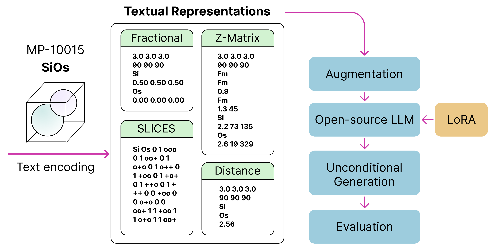

# LLM4StructGen
Benchmarking Text Representations for Crystal Structure Generation with Large Language Models

<figure>
  
</figure>


## Usage
```
# see environment setup below
pip install -e .

# default logging dir is exp/logs
mkdir -p exp/logs
```

In general, to train a model in `torchtune` we can do the following:

```
# single device
tune run [RECIPE] --config [PATH/TO/YAML]

# distributed 
# 1 node, 4 GPUs
tune run --nnodes 1 --nproc_per_node 4 [RECIPE] --config [PATH/TO/YAML]
```

The first argument, [RECIPE], specifies the template to be used for this run. Recipes can be thought of as pipelines for training or inference. (see more [here](https://pytorch.org/torchtune/main/deep_dives/recipe_deepdive.html)).

### Sample Run (LLaMA-2 with LoRA on Cartesian/Fractional Representations)
First, we need to download checkpoint weights from HuggingFace:
```
tune download meta-llama/Llama-2-7b-hf \
  --output-dir /tmp/Llama-2-7b-hf \
  --hf-token <ACCESS TOKEN>
```
where `<ACCESS TOKEN>` is your HuggingFace authorization token. Note that the `/tmp/` folder is recycled after a session ends. You might want to move the weights to the scratch directory or the project space.

To start training, do

```
tune run lora_finetune_single_device \
--config configs/train/llama2/7B_lora_single_device.yaml \
dataset.representation_type=zmatrix \
metric_logger.name=llama2_7b_zmatrix
```

By default, `wandb` is used for logging.

### Generation
```
tune run llm4structgen/generation/inference.py \
--config configs/inference/llama2.yaml \
generation.n_structures=10 \
...
```

You need to modify the checkpoint paths in the yaml file to load the finetuned checkpoints.

Currently, only single-device non-batch inference is supported. 

> Note: The generation script produces only text output. Post-decoding is required to convert these strings into Atoms objects. This decoupling ensures that any parsing errors are handled separately from the generation process.

### Modify Configs
You can copy the template `.yaml` config file and modify the fields in the copy for your training purposes. 

Additionally, you can also modify it in the command line:

```
tune run lora_finetune_single_device \
    --config configs/train/llama2/7B_lora_single_device.yaml \
    batch_size=8 \
    dataset.representation_type=distance \
    ...
```

### Evaluation
We will obtain a `.json` file after inference which contains all the generated strings.

To decode all string representations into cif files, we can do
```
python llm4structgen/evaluation/evaluate.py --config [PATH/TO/JSON] --save
```
Note, `--save` flag is used to save all decoded strings. To view only the success rate, simply omit the `--save` flag.

To decode and calculate CDVAE metrics, do
```
python llm4structgen/evaluation/evaluate.py --config [PATH/TO/JSON] --save --eval
```
Note, this requires 10000 valid string representations.

If you already have a directory with 10,000 cif files and want to evaluate them directly, do:

```
python llm4structgen/evaluation/evaluate.py --config [PATH/TO/JSON] --cif_dir [PATH/TO/DIR]
```

#### Crystal-text-LLM IPT (Increase in Perplexity under Transformation)
We include a script to calculate IPT as proposed by [Gruver et al.](https://arxiv.org/abs/2402.04379), where
$$
IPT(s) = \mathbb{E}_{g\in G} \left[ PPL(t_g (s)) - PPL(t_{g^{*}}(s))\right],
$$
where $s$ is the input structure, $PPL$ is the perplexity of the input sequence, and $t_g$ is the mapping that applies invariant operation on $s$ and encodes it as a string representation. In particular, $g^* = \arg \min PPL(t_g(s))$.

## ⚙️ Environment Setup
```
conda create -n llm4structgen python=3.10
pip install torch torchvision

# install torchtune in target folder
# DO NOT install torchtune via pip directly 
# pip install torchtune won't work with our code
# use forked version below 
git clone https://github.com/shuyijia/torchtune.git
cd torchtune
pip install -e .

# install llm4structgen in target folder
git clone https://github.com/shuyijia/LLM4StructGen.git
cd LLM4StructGen
pip install -e .

# additional packages
pip install ase pymatgen wandb

# CDVAE evaluation metrics
pip install matminer p-tqdm smact==2.2.1

# SLICES
pip install tensorflow==2.15.0
pip install slices
pip install mace-torch
```

